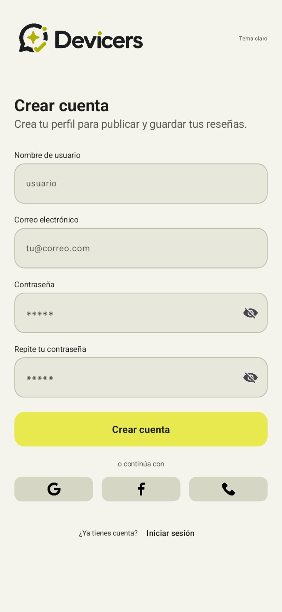
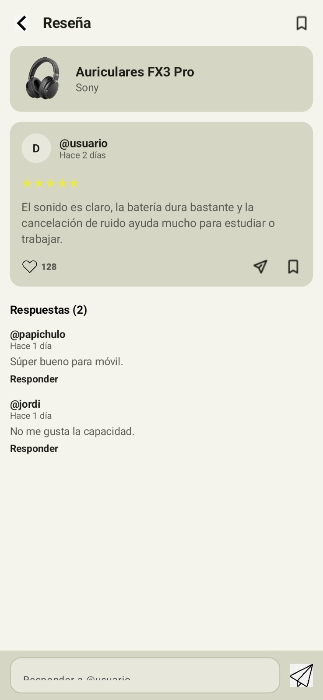
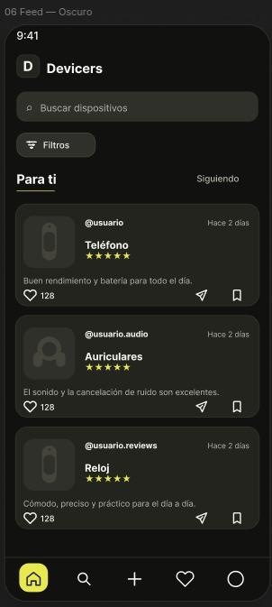
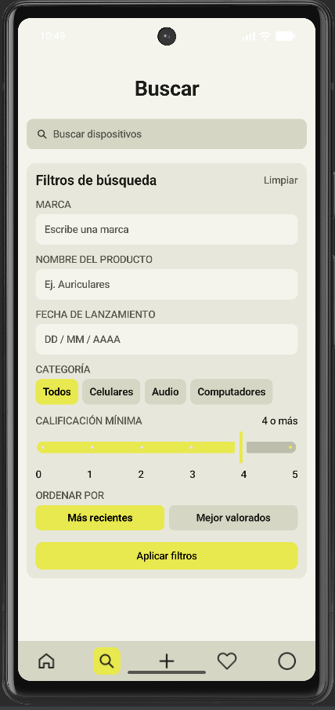
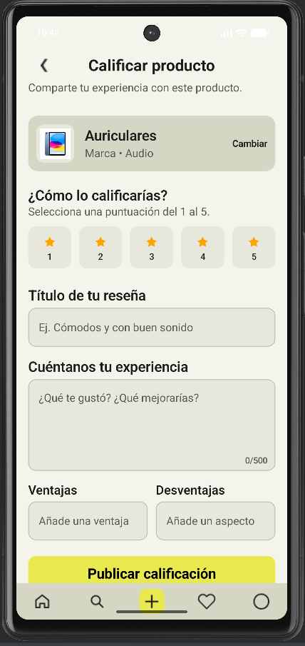
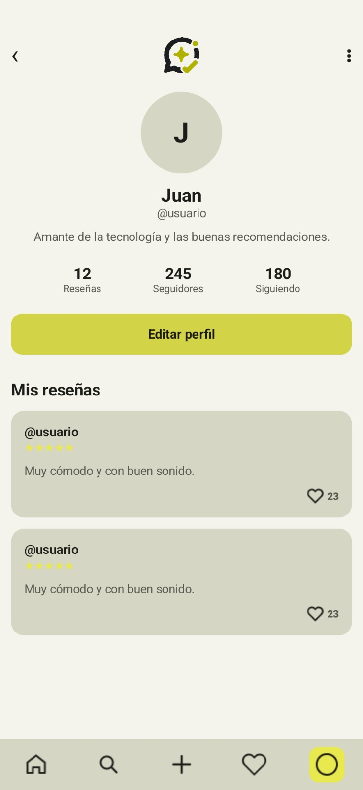
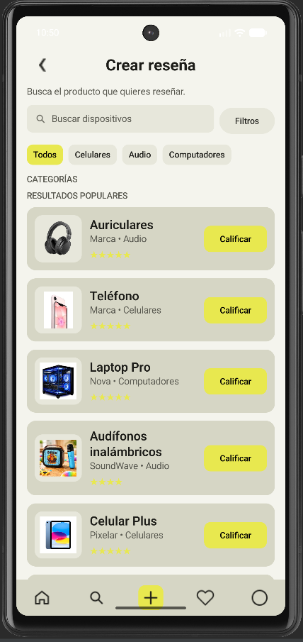
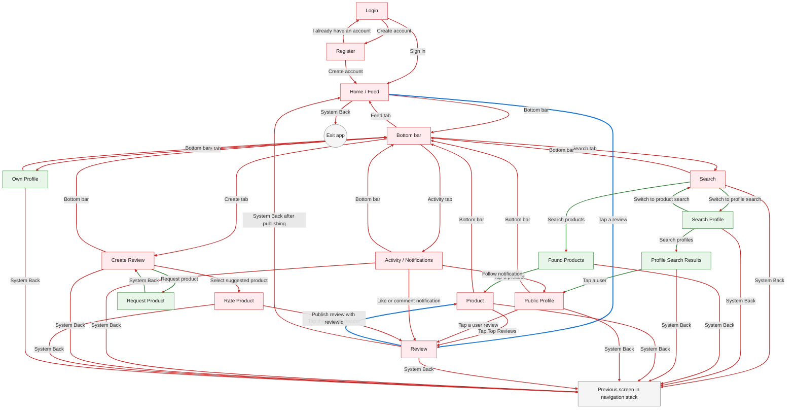
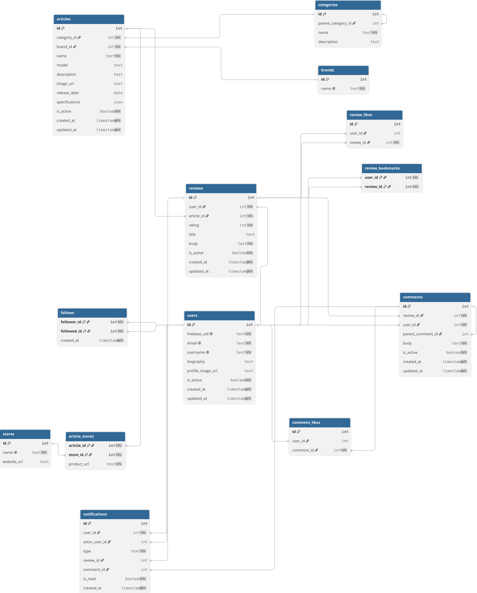

# Tech Review App

Android technology-review application created for the Mobile Computing course at Pontificia Universidad Javeriana.

The application is envisioned as a small social network where people can discover technology products, rate them, and share reviews with the community.

## Design

### Interface prototype

The Devicers interface prototype is available on <a href="https://www.figma.com/design/l7mETjAKWkyAFwtx1VWmIX/Untitled?node-id=1-484&amp;t=p0lttPj7kJNiSUG2-1" target="_blank" rel="noopener noreferrer">Figma</a>.

| Sign-in screen | Registration screen |
| --- | --- |
|  |  |

| Review screen | Feed screen |
| --- | --- |
|  |  |

| Search screen | Rate product screen |
| --- | --- |
|  |  |

| Notifications screen | Profile screen |
| --- | --- |
|  |  |

| Product screen | Create review screen |
| --- | --- |
|  |  |

### Logos

  

## Sprint 4 — Navigation map

> This diagram is written in [Mermaid](https://mermaid.js.org/), so it can be updated directly in this README as the application evolves. Every arrow labels the user action that triggers the transition.

### Navigation conventions

- **Red routes** are current or planned Sprint 4 navigation paths.
- **Blue routes** are the two special detail relationships: **Feed → Review** when a review is selected, and **Review → Product** when the product header is selected.
- **Green routes and screens** are pending design or implementation: Found Products, Request Product, Own Profile, Search Profile, and Profile Search Results.
- The Bottom bar leads to Home / Feed, Search, Create Review, Activity / Notifications, and Own Profile. Rate Product does not display it.
- System Back exits the application from Home / Feed. It returns to the prior entry in the navigation stack from the other screens. Search has no visual Back button, but still supports System Back.
- Publishing from Rate Product opens the newly created Review using its `reviewId`. The Rate Product destination must be removed from the stack, so System Back from that Review returns to Home / Feed.

## Data model

## Object-oriented class diagram

> The diagram is an SVG vector image. Download it or open it directly in a browser to zoom in and inspect the relationships without losing quality.

### Entity-relationship diagram

> The diagram is an SVG vector image. Download it or open it directly in a browser to zoom in and inspect the relationships without losing quality.

## Sprint 1

- **Course:** Mobile Computing — Pontificia Universidad Javeriana.
- **Professor:** Juan Sebastián Angarita Torres.
- **Date:** August 2, 2026.
- **Team:** Daniel Felipe Ramírez Vargas, Edwin Esteban Barreto Gaitán, and Guillermo Andrés Aponte Cárdenas.

### Deliverables

- Functional requirements document.
- Database entity-relationship diagram.
- Object-oriented class diagram.
- Logo, color palette, and application name definition.
- Four initial screens.

## Functional requirements

- **FR-01 to FR-04 — Authentication:** create an account with an email address, username, and password; sign in; and restrict features to registered users.
- **FR-05 and FR-06 — Feed:** show reviews from followed accounts, ordered from newest to oldest.
- **FR-07 to FR-11 and FR-30 to FR-32 — Product discovery:** browse products by categories and subcategories; filter by subcategory or brand; search, select, and view product details; and access stores where a product is available.
- **FR-25, FR-26, and FR-33 to FR-36 — Community reviews:** show reviews from other users with author, date, rating, likes, and access to the author's profile; users can hide or delete their own reviews and manage review likes.
- **FR-12 to FR-16 — Ratings and reviews:** rate products using integer values from 0 to 5, write an analysis, allow only one review per user and product, and allow later edits.
- **FR-17, FR-27, FR-28, and FR-37 to FR-40 — Comments:** comment on other users' analyses, including users who are not followed; reply to, edit, hide, or delete own comments; and manage comment likes.
- **FR-29 and FR-44 to FR-45 — Following:** follow or unfollow users, view followers and followed users, and prevent self-following.
- **FR-18 to FR-20 — Profile:** update profile information and photo, delete the account, and view all products rated by the user.
- **FR-21 to FR-23 — Notifications:** notify users about new followers, comments on their reviews, and likes on their reviews.
- **FR-24 — Review reading:** select a review from the feed to view its full content.
- **FR-41 to FR-43 and FR-46 to FR-47 — Account and saved content:** save reviews, view saved reviews, view public profile details, sign out, and hide content without permanently deleting it.

## Technical scope

The project will use MVVM architecture and patterns such as Repository and dependency injection. It includes a REST API with an SQL database, Firebase Authentication and Firestore, automated testing, and Firebase notifications.
